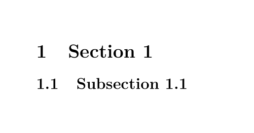
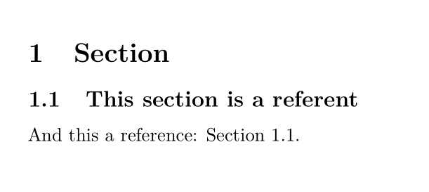
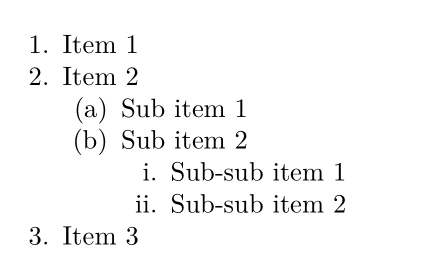

# Formatting guide

We are seeking a sweet spot between plain text readability and rich semantic
encoding. As our practice proceeds, we have begun to establish some useful
idioms and best practices for representing common legal constructs in markdown.
We have opted for the less common [pandoc markdown][pandoc-markdown] variant,
because of its support for expressive annotations that can be layered on top of
markdown's clear but minimal syntax and the ease with which the syntax can be
augmented via filters.

## The YAML Header

### Titles and subtitles

The title and subtitle of a document should be specified in the [YAML metadata
header][yaml-header]. E.g., for a contract titled "My First Contract: An
Example" written in the file `my-first-contract.md`, the file should begin

```markdown
---
title: My First Contract
subtitle: An Example
---
```

Either field may include multiple lines of text formatted using markdown, if
the value of the YAML field uses the literal style format specifier `|`. E.g.,
if we want our title to span multiple lines, and include an emphasized span:

```markdown
---
title: |
    | My **Multiline** Title
    | with an Emphasized Spans
---
```

### Metadata

The YAML header can include any additional arbitrary metadata. We sometimes use
it to encode the location of a file from which the plain text contract has been
derived, or the URL of a form that the contract represents.

It can also be used to pass instructions to pandoc to tweak the way that the
document is processed when exporting to pdf (or other formats). See the pandoc
documentation on the [YAML metadata block][yaml-header] for details.

## Sections and clauses

### Sections are delimited by headers

A section of a contract is specified by a header:

```markdown
# Section 1

The content of section 1.
```

Sections can be nested

<a id="subsection-example"></a>
```markdown
# Section 1

## Subsection 1.1
```

### Section numbering

By default, sections will be numbered using a dot separated, nested, enumeration
on export. E.g., the [subsection example](#subsection-example) renders as



#### Disable numbering for a section

To disable numbering for a section, specify that the section is `unnumbered` via
a class ascription

```markdown
# An unnumbered section {.unnumbered}
```

Or the shorthand `{-}`

```markdown
# Another unnumbered section {-}
```

### Clauses are just sections

We represent clauses and subclauses via header-delimited sections with
descriptive titles. E.g., a clause specifying dividends on shares might
look like this:

```markdown
### Dividends

Subject to any unanimous shareholder agreement with respect to the Corporation
then in force, the holders of Shares are entitled to receive dividends if, as
and when declared by the Board on the Shares.
```

## Cross references

We use [`pandoc-crossref`][pandoc-crossref] to generate links to cross
references.

`pandoc-corssref` is able to generate cross references to tables, figures, code
blocks and more, but we generally only need it to generate cross references to
sections/clauses.

To label a section as a possible reference, give the header an id with the
syntax `sec:<label>`. To refer to the section, use the syntax `@sec:<label>`

E.g.,

```markdown
# Section

## This section is a referent {#sec:referent}

And this a reference: @sec:referent.
```

The above will render as




`Section 1.1` will be a hyperlink anchored to the section heading 1.1.

## Enumerated lists

### Auto-numbered lists

We prefer the `#.` syntax for enumerating lists when we don't care about which 
enumerator will be used:

```markdown
#. Item 1
#. Item 2
#. Item 3
    #. Sub item 1
    #. Sub item 2
        #. Sub-sub item 1
```

Note that sublists are set off by four indented spaces.

Pandoc will take care of enumerating the items:



### Specifying the enumeration

You can specify the kind of enumeration you want by making it explicit. E.g.:

```markdown
(a) Item 1
(b) Item 2
(c) Item 3

i. Item 1
ii. Item 2
iii. Item 3
```

See the [Pandoc documentation on lists][pandoc-lists] for more.


[pandoc-markdown]: https://pandoc.org/MANUAL.html#pandocs-markdown

[yaml-header]: https://pandoc.org/MANUAL.html#extension-yaml_metadata_block

[pandoc-crossref]: http://lierdakil.github.io/pandoc-crossref/

[pandoc-lists]: https://pandoc.org/MANUAL.html#lists
